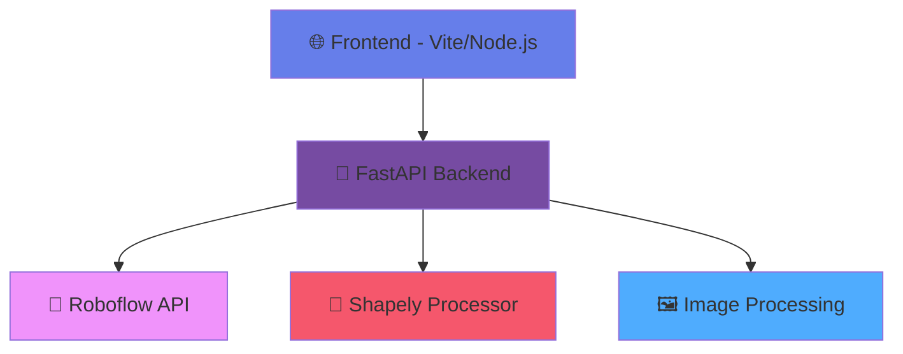

<div align="center">

# 🏗️ **FloorIA**

*AI-Powered Architectural Image Analysis Platform*

[](https://python.org)
[](https://fastapi.tiangolo.com)
[](https://nodejs.org)
[](https://typescriptlang.org)
[](https://vitejs.dev)
[](https://roboflow.com)

[](https://opensource.org/licenses/MIT)
[](https://github.com/dean/vectorizator/graphs/commit-activity)
[](https://github.com/dean/vectorizator/issues)
[](https://github.com/dean/vectorizator/stargazers)

*Une application d'analyse d'images avec IA composée d'un frontend TypeScript/Vite moderne avec architecture à composants et d'un backend Python utilisant Shapely pour le traitement géométrique et l'API Roboflow pour la détection d'objets.*

[🚀 Demo](#demo) • [📖 Documentation](#documentation) • [⚡ Quick Start](#quick-start) • [🤝 Contributing](#contributing)

</div>

---

## ✨ Features

<table>
<tr>
<td width="50%">

### 🎨 **Modern TypeScript Architecture**
- 🏗️ **Component-Based Design** - Modular Header, Footer, Toolbar, Canvas, DetectionPanel
- 📘 **TypeScript Integration** - Full type safety and modern development experience
- 🎨 **Visual Studio Code Theme** - Authentic dark theme with VSCode colors
- 🖼️ **Maximized Canvas Area** - Full workspace without left sidebar
- 🔧 **Integrated Toolbar** - All controls in compact header
- 📋 **Detection Cards Panel** - Modern card-based detection list
- 🎯 **Highlight Animation** - Temporary pulsing overlay on selection
- 📊 **Sortable Detection Data** - Click headers to sort by any criteria
- 🏢 **Professional Footer** - Corporate branding with company info

</td>
<td width="50%">

### 🤖 **AI & Analysis**
- 🏗️ **Architectural Element Detection**
- 📐 **Shapely Geometric Processing**
- 🎯 **Roboflow API Integration**
- 📊 **Real-time Bounding Box Overlay**
- 📈 **Confidence Score Visualization**
- 🔢 **Geometric Data Display**

</td>
</tr>
</table>

## 🏗️ Architecture



## 📁 Project Structure

```
🏗️ FloorIA/
├── 🌐 frontend/
│   ├── 📄 index.html          # Minimal HTML entry point
│   ├── 📦 package.json        # TypeScript + Vite dependencies
│   ├── ⚙️ vite.config.js      # Vite configuration with TS support
│   ├── 📘 tsconfig.json       # TypeScript configuration
│   └── 📂 src/
│       ├── 🚀 main.ts         # Application entry point
│       ├── 📂 components/
│       │   ├── 🏠 Header.ts   # Header component with logo & status
│       │   ├── 🦶 Footer.ts   # Footer with branding & model info
│       │   ├── 🔧 Toolbar.ts  # Toolbar with controls
│       │   ├── 🖼️ Canvas.ts   # Canvas component with interactions
│       │   └── 📋 DetectionPanel.ts # Detection list panel
│       ├── 📂 types/
│       │   └── 📘 index.ts    # TypeScript type definitions
│       ├── 📂 utils/
│       │   ├── 🌐 api.ts      # API client utilities
│       │   └── 🖼️ canvas.ts   # Canvas drawing utilities
│       └── 📂 styles/
│           └── 🎨 main.css    # Global styles
├── 🐍 backend/
│   ├── 🚀 main.py             # FastAPI server with CORS
│   ├── 🤖 roboflow_client.py  # Roboflow API integration
│   ├── 📐 geometry_processor.py # Shapely geometric analysis
│   ├── 📋 requirements.txt    # Python dependencies
│   └── 🔐 .env.example        # Environment variables template
├── 📚 README.md               # This file
└── 🔒 .gitignore             # Git ignore rules
```

## 🆕 Recent Updates

### v3.0.0 - TypeScript Component Architecture Migration (January 2025)

#### 🏗️ **Complete Frontend Refactoring**
- ✅ **TypeScript Migration** - Full conversion from JavaScript to TypeScript with strict type checking
- ✅ **Component-Based Architecture** - Modular design with Header, Footer, Toolbar, Canvas, and DetectionPanel components
- ✅ **Modern Development Experience** - Vite with TypeScript support, path aliases, and hot module replacement
- ✅ **Type Safety** - Comprehensive type definitions for all data structures and component interfaces
- ✅ **Maintainable Code** - Clear separation of concerns with utils, types, and components folders

#### 📦 **New Project Structure**
- ✅ **Modular Components** - Each UI component is a separate TypeScript class with clear responsibilities
- ✅ **Utility Modules** - API client and canvas utilities extracted into reusable modules
- ✅ **Type Definitions** - Centralized TypeScript interfaces for better code documentation
- ✅ **Build System** - Updated Vite configuration with TypeScript compilation and path resolution

#### 🔧 **Technical Improvements**
- ✅ **Event-Driven Architecture** - Components communicate through custom events and handlers
- ✅ **Error Handling** - Robust error management with TypeScript strict null checks
- ✅ **Code Organization** - Clean folder structure following modern frontend best practices
- ✅ **Development Workflow** - Type checking, linting, and modern build pipeline

### v2.0.0 - Visual Studio Code Interface Redesign (January 2025)

#### 🎨 **Complete UI/UX Overhaul**
- ✅ **VSCode Theme Applied** - Authentic Visual Studio Code dark theme with proper colors (`#1e1e1e`, `#3c3c3c`, `#252526`)
- ✅ **Consolas Font** - Professional monospace typography matching VSCode
- ✅ **Compact Layout** - Removed unnecessary left sidebar, maximized canvas workspace
- ✅ **Integrated Toolbar** - All controls (import, zoom, opacity) moved to compact header

#### 📋 **Detection Panel Redesign**
- ✅ **Card-Based Layout** - Replaced cramped table with readable detection cards
- ✅ **Smart Sorting** - Dropdown + direction toggle for better UX in narrow panel
- ✅ **Improved Readability** - Proper spacing and typography for 350px width
- ✅ **Smooth Interactions** - Auto-scroll to selected detection card

#### 🎯 **Enhanced Interactions**
- ✅ **Highlight Animation** - Temporary pulsing overlay instead of disruptive zoom
- ✅ **Drag & Drop** - File drop support on canvas area
- ✅ **Professional Footer** - Corporate branding (Deep-5 et BTP Consultants)

#### 🔧 **Technical Improvements**
- ✅ **Robust JavaScript** - All DOM access secured against null references
- ✅ **Error Prevention** - Comprehensive null checks for style properties
- ✅ **Memory Management** - Proper cleanup of highlight overlays
- ✅ **Responsive Design** - Optimized for professional architectural workflows

#### 🏢 **Professional Branding**
- ✅ **Footer Integration** - "FloorIA - Analyse Architecturale IA | Deep-5 et BTP Consultants | 60 rue François 1er, 75008 PARIS"
- ✅ **VSCode Status Bar** - Blue accent bar matching Visual Studio Code
- ✅ **Corporate Identity** - Professional appearance for architectural industry

---

## ⚡ Quick Start

### 🐍 Backend Setup

```bash
# Navigate to backend directory
cd backend

# Create virtual environment
python -m venv venv
source venv/bin/activate  # Linux/Mac
# venv\Scripts\activate   # Windows

# Install dependencies
pip install -r requirements.txt

# Configure environment
cp .env.example .env
# Edit .env with your Roboflow API credentials

# Start the server
python main.py
```

### 🌐 Frontend Setup

```bash
# Navigate to frontend directory
cd frontend

# Install dependencies
npm install

# Start development server
npm run dev
```

### 🚀 Access the Application

- **Frontend**: http://localhost:3000
- **Backend API**: http://localhost:8000
- **API Documentation**: http://localhost:8000/docs

## 🎯 Scripts de Démarrage Automatisés

Pour simplifier le développement, des scripts de démarrage automatisés sont disponibles :

### 🐍 Démarrage Backend
```bash
./start-backend.sh
```

**Ce script :**
- ✅ Vérifie la présence du répertoire backend
- 🐍 Crée l'environnement virtuel Python si nécessaire
- 📦 Installe automatiquement les dépendances
- 🔐 Vérifie la configuration `.env`
- 🚀 Démarre le serveur FastAPI sur http://localhost:8000

### 🌐 Démarrage Frontend
```bash
./start-frontend.sh
```

**Ce script :**
- ✅ Vérifie la présence du répertoire frontend
- 📋 Vérifie que Node.js et npm sont installés
- 📦 Installe les dépendances npm si nécessaire
- 🚀 Démarre le serveur Vite sur http://localhost:3000

### 🚀 Démarrage Complet
Pour démarrer l'application complète :

```bash
# Terminal 1 - Backend
./start-backend.sh

# Terminal 2 - Frontend (dans un nouveau terminal)
./start-frontend.sh
```

> 💡 **Astuce**: Les scripts incluent toutes les vérifications nécessaires et vous guideront en cas de problème (dépendances manquantes, fichiers de configuration, etc.)

## 🔧 Configuration

### 🤖 Roboflow Integration

**🔐 SECURITY FIRST**: Never commit API keys to git!

1. Copy the environment template:
```bash
cd backend
cp .env.example .env
```

2. Edit `.env` with your actual Roboflow credentials:
```env
# ⚠️ KEEP THIS FILE LOCAL - NEVER COMMIT TO GIT!
ROBOFLOW_API_KEY=your_actual_api_key_here
ROBOFLOW_WORKSPACE=cubicasa5k-2-qpmsa-tppfc
ROBOFLOW_PROJECT=cubicasa5k-2-qpmsa-tppfc
ROBOFLOW_VERSION=1
```

3. The `.env` file is automatically excluded from git via `.gitignore`

**✅ Security Features:**
- 🔒 API keys loaded from environment variables only
- 🚫 `.env` files excluded from git commits
- ⚠️ Warning messages if API key is missing
- 📝 Clear documentation on secure practices

## 🎮 Usage Guide

### 📤 Upload & Analysis
1. **Upload Image**: Drag & drop or click to select an architectural image
2. **AI Analysis**: Automatic processing with Roboflow API
3. **View Results**: Bounding boxes overlaid on the image

### 🔍 Navigation & Interaction
- **Zoom In/Out**: Use `+` and `−` buttons
- **Fit to Window**: Click `⌂` to auto-fit image
- **Pan**: Click and drag to navigate
- **Mouse Wheel**: Zoom towards cursor position
- **Table Selection**: Click rows to highlight detections
- **Opacity Control**: Adjust background image transparency

### 📊 Data Analysis
- **Interactive Table**: View all detection data
- **Geometric Information**: Position, dimensions, area, perimeter
- **Confidence Scores**: Visual bars with percentage values
- **Selection Highlighting**: Visual emphasis on selected detections

## 🚀 Production Deployment with Railway

### 🌟 Why Railway?

FloorIA is configured for seamless deployment on **Railway**, a modern platform that provides:

- ✅ **Zero-Config Deployment** - Automatic detection of Python and Node.js projects
- ✅ **GitHub Integration** - Automatic deployments on git push
- ✅ **Production Branch Control** - Deploys only from `production` branch
- ✅ **Built-in Database Support** - PostgreSQL, MySQL, Redis ready for future features
- ✅ **Environment Variables** - Secure configuration management
- ✅ **Custom Domains** - Professional URLs for your application
- ✅ **Real-time Logs** - Comprehensive monitoring and debugging

### 🏗️ Architecture Overview

```
FloorIA Production Deployment
├── 🌐 Frontend Service (Vite + TypeScript)
│   ├── 📦 Nixpacks auto-detection
│   ├── 🔧 Build: npm ci && npm run build
│   └── 🚀 Start: vite preview --host 0.0.0.0
├── 🐍 Backend Service (FastAPI + Python)
│   ├── 📦 Nixpacks auto-detection
│   ├── 🔧 Build: pip install -r requirements.txt
│   └── 🚀 Start: uvicorn main:app --host 0.0.0.0
└── 🗄️ Database Service (Future: PostgreSQL)
    └── 🔗 Automatic DATABASE_URL injection
```

### 📋 Prerequisites

1. **Railway Account**: Sign up at [railway.app](https://railway.app)
2. **GitHub Connection**: Link your GitHub account to Railway
3. **Repository Access**: Ensure Railway can access the `naptax/FloorIA` repository
4. **API Credentials**: Have your Roboflow API key ready (never commit to git!)

### 🚀 Step-by-Step Deployment Guide

#### 1. **Create Railway Project**

```bash
# Railway will auto-detect the project structure
1. Go to railway.app dashboard
2. Click "New Project"
3. Select "Deploy from GitHub repo"
4. Choose "naptax/FloorIA"
5. ⚠️ IMPORTANT: Set branch to "production"
```

#### 2. **Configure Backend Service**

```yaml
# Railway automatically detects backend/railway.json
Service Name: flooria-backend
Root Directory: /backend
Build Command: pip install -r requirements.txt
Start Command: uvicorn main:app --host 0.0.0.0 --port $PORT
Health Check: /health
```

**Environment Variables** (Set in Railway Dashboard):
```env
# ⚠️ NEVER commit these values to git!
ROBOFLOW_API_KEY=your_roboflow_api_key_here
ROBOFLOW_WORKSPACE=your_workspace_name
ROBOFLOW_PROJECT=your_project_name
ROBOFLOW_VERSION=1
CORS_ORIGINS=https://your-frontend-domain.railway.app
ENVIRONMENT=production
```

#### 3. **Configure Frontend Service**

```yaml
# Railway automatically detects frontend/railway.json
Service Name: flooria-frontend
Root Directory: /frontend
Build Command: npm ci && npm run build
Start Command: npm run preview -- --host 0.0.0.0 --port $PORT
Health Check: /
```

**Environment Variables** (Set in Railway Dashboard):
```env
VITE_API_BASE_URL=https://your-backend-domain.railway.app
NODE_ENV=production
```

#### 4. **Domain Configuration**

Railway provides automatic domains:
- **Backend**: `https://flooria-backend-production.up.railway.app`
- **Frontend**: `https://flooria-frontend-production.up.railway.app`

**Custom Domains** (Optional):
```
Backend API: api.flooria.com
Frontend App: app.flooria.com
```

### 🔄 Deployment Workflow

#### **Development → Production Pipeline**

```bash
# 1. Development on master branch
git checkout master
git add .
git commit -m "feat: new feature implementation"
git push origin master

# 2. Deploy to production (triggers Railway build)
git checkout production
git merge master
git push origin production  # 🚀 Automatic deployment starts!
```

#### **Rollback Strategy**

```bash
# Quick rollback to previous version
git checkout production
git reset --hard HEAD~1  # Go back one commit
git push --force origin production  # Deploy previous version
```

### 📊 Monitoring & Maintenance

#### **Health Monitoring**
- **Backend Health**: `https://your-backend.railway.app/health`
- **Frontend Health**: `https://your-frontend.railway.app/`
- **Railway Dashboard**: Real-time service status

#### **Log Access**
```bash
# Via Railway CLI (optional)
npm install -g @railway/cli
railway login
railway logs --service flooria-backend
railway logs --service flooria-frontend
```

#### **Performance Metrics**
- 📈 **Request Volume**: Track API usage
- ⚡ **Response Times**: Monitor performance
- 💾 **Memory Usage**: Optimize resource consumption
- 🔄 **Deployment Frequency**: Track release velocity

### 🔮 Future Enhancements

#### **Database Integration** (Ready for Implementation)

```bash
# Add PostgreSQL service in Railway
1. Railway Dashboard → Add Service → Database → PostgreSQL
2. Automatic DATABASE_URL environment variable
3. Update backend requirements.txt:
```

```python
# Additional dependencies for database
psycopg2-binary==2.9.7
sqlalchemy==2.0.21
alembic==1.12.1
```

#### **Advanced Features Roadmap**
- 🔐 **Authentication System**: User management and API security
- 📊 **Analytics Dashboard**: Usage statistics and insights
- 🗄️ **Data Persistence**: Save analysis results and user projects
- 🔄 **Batch Processing**: Handle multiple images simultaneously
- 📱 **Mobile Optimization**: Responsive design improvements

### 🛡️ Security Best Practices

#### **Environment Variables Security**
- ✅ **Never commit secrets** to git repositories
- ✅ **Use Railway's secure variable storage**
- ✅ **Rotate API keys regularly**
- ✅ **Monitor access logs**
- ✅ **Enable CORS properly** for production domains

#### **Production Hardening**
```python
# Backend security headers (already implemented)
app.add_middleware(
    CORSMiddleware,
    allow_origins=os.getenv("CORS_ORIGINS", "").split(","),
    allow_credentials=True,
    allow_methods=["GET", "POST"],
    allow_headers=["*"],
)
```

### 💰 Cost Optimization

#### **Railway Pricing Tiers**
- **Hobby Plan**: $5/month per service (recommended for development)
- **Pro Plan**: $20/month per service (recommended for production)
- **Database**: $5/month for PostgreSQL (when needed)

#### **Resource Optimization**
- 🔧 **Right-sizing**: Monitor and adjust resource allocation
- ⏱️ **Sleep Mode**: Automatic scaling down during low usage
- 📊 **Usage Analytics**: Track and optimize resource consumption

### 🆘 Troubleshooting Guide

#### **Common Deployment Issues**

| Issue | Symptom | Solution |
|-------|---------|----------|
| **Build Failed** | Red deployment status | Check `requirements.txt`/`package.json` |
| **Health Check Failed** | Service unreachable | Verify `/health` endpoint |
| **CORS Errors** | Frontend can't reach API | Update `CORS_ORIGINS` variable |
| **Environment Variables** | Configuration errors | Verify all required vars are set |
| **Port Binding** | Service won't start | Ensure `--port $PORT` in start command |

#### **Debug Commands**
```bash
# Check service logs
railway logs --service flooria-backend --lines 100

# Verify environment variables
railway variables --service flooria-backend

# Test health endpoints
curl https://your-backend.railway.app/health
curl https://your-frontend.railway.app/
```

### 📞 Support Resources

- 📖 **Railway Documentation**: [docs.railway.app](https://docs.railway.app)
- 💬 **Railway Discord**: [discord.gg/railway](https://discord.gg/railway)
- 🐛 **FloorIA Issues**: [GitHub Issues](https://github.com/naptax/FloorIA/issues)
- 📧 **Technical Support**: Contact the development team

---

## 🛠️ Technology Stack

<div align="center">

### Frontend Technologies
[](https://vitejs.dev)
[](https://javascript.info)
[](https://html.spec.whatwg.org)
[](https://www.w3.org/Style/CSS)
[](https://developer.mozilla.org/en-US/docs/Web/API/Canvas_API)

### Backend Technologies
[](https://fastapi.tiangolo.com)
[](https://python.org)
[](https://shapely.readthedocs.io)
[](https://pillow.readthedocs.io)
[](https://www.uvicorn.org)

</div>

## 📊 API Documentation

### 🔗 Endpoints

| Method | Endpoint | Description | Response |
|--------|----------|-------------|----------|
| `GET` | `/` | API status | `{"message": "FloorIA Backend API", "status": "running"}` |
| `POST` | `/analyze` | Image analysis | Detection results with geometric data |
| `GET` | `/health` | Health check | `{"status": "healthy", "service": "vectorizator-backend"}` |

### 📝 Request/Response Examples

<details>
<summary><b>POST /analyze - Image Analysis</b></summary>

**Request:**
```bash
curl -X POST "http://localhost:8000/analyze" \
     -H "accept: application/json" \
     -H "Content-Type: multipart/form-data" \
     -F "image=@your_image.jpg"
```

**Response:**
```json
{
  "status": "success",
  "image_dimensions": {
    "width": 1920,
    "height": 1080
  },
  "detections": [
    {
      "label": "room",
      "confidence": 0.85,
      "bbox": {
        "x": 100,
        "y": 150,
        "width": 300,
        "height": 200
      },
      "geometry": {
        "area": 60000,
        "perimeter": 1000,
        "centroid": {"x": 250, "y": 250}
      }
    }
  ]
}
```
</details>

## 🎯 Use Cases

- 🏠 **Architectural Analysis**: Floor plan element detection
- 🏗️ **Construction Planning**: Room and structure identification
- 📐 **Space Planning**: Geometric analysis of architectural elements
- 🎨 **Design Validation**: Automated architectural review
- 📊 **Property Assessment**: Automated space measurement

## 🚧 Development

### 🔄 Development Workflow

```bash
# Clone the repository
git clone https://github.com/dean/vectorizator.git
cd vectorizator

# Setup backend
cd backend && python -m venv venv && source venv/bin/activate
pip install -r requirements.txt

# Setup frontend
cd ../frontend && npm install

# Start both servers
# Terminal 1: Backend
cd backend && python main.py

# Terminal 2: Frontend
cd frontend && npm run dev
```

### 🧪 Testing

```bash
# Backend tests
cd backend
python -m pytest

# Frontend tests
cd frontend
npm test
```

## 🤝 Contributing

Contributions are welcome! Please feel free to submit a Pull Request.

1. 🍴 Fork the repository
2. 🌟 Create your feature branch (`git checkout -b feature/AmazingFeature`)
3. 💾 Commit your changes (`git commit -m 'Add some AmazingFeature'`)
4. 📤 Push to the branch (`git push origin feature/AmazingFeature`)
5. 🔄 Open a Pull Request

## 📄 License

This project is licensed under the MIT License - see the [LICENSE](LICENSE) file for details.

## 🙏 Acknowledgments

- 🤖 [Roboflow](https://roboflow.com) for AI model hosting
- 📐 [Shapely](https://shapely.readthedocs.io) for geometric computations
- ⚡ [FastAPI](https://fastapi.tiangolo.com) for the robust backend framework
- 🚀 [Vite](https://vitejs.dev) for the lightning-fast frontend tooling

---

<div align="center">

**Made with ❤️ for architectural analysis and AI-powered image processing**

[](https://github.com/dean/vectorizator)

</div>