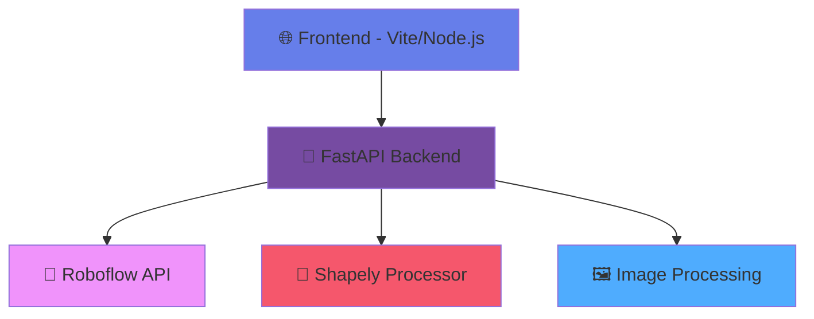

<div align="center">

# 🏗️ **FloorIA**

*AI-Powered Architectural Image Analysis Platform*

[](https://python.org)
[](https://fastapi.tiangolo.com)
[](https://nodejs.org)
[](https://vitejs.dev)
[](https://roboflow.com)

[](https://opensource.org/licenses/MIT)
[](https://github.com/dean/vectorizator/graphs/commit-activity)
[](https://github.com/dean/vectorizator/issues)
[](https://github.com/dean/vectorizator/stargazers)

*Une application d'analyse d'images avec IA composée d'un frontend Node.js/Vite et d'un backend Python utilisant Shapely pour le traitement géométrique et l'API Roboflow pour la détection d'objets.*

[🚀 Demo](#demo) • [📖 Documentation](#documentation) • [⚡ Quick Start](#quick-start) • [🤝 Contributing](#contributing)

</div>

---

## ✨ Features

<table>
<tr>
<td width="50%">

### 🎨 **Advanced UI/UX**
- 🖼️ **Large Visualization Window** (600px height)
- 🔍 **Interactive Zoom Controls** (In/Out/Fit-to-Window)
- 🖱️ **Pan & Drag Navigation**
- 🎯 **Mouse Wheel Zoom** with smart positioning
- 📊 **Interactive Data Table** with selectable rows
- 🎪 **Auto-zoom to Selected Detections**

</td>
<td width="50%">

### 🤖 **AI & Analysis**
- 🏗️ **Architectural Element Detection**
- 📐 **Shapely Geometric Processing**
- 🎯 **Roboflow API Integration**
- 📊 **Real-time Bounding Box Overlay**
- 📈 **Confidence Score Visualization**
- 🔢 **Geometric Data Display**

</td>
</tr>
</table>

## 🏗️ Architecture



## 📁 Project Structure

```
🏗️ FloorIA/
├── 🌐 frontend/
│   ├── 📄 index.html          # Modern UI with advanced controls
│   ├── ⚡ main.js             # Interactive zoom, pan & table logic
│   ├── 📦 package.json        # Node.js dependencies
│   └── ⚙️ vite.config.js      # Vite configuration
├── 🐍 backend/
│   ├── 🚀 main.py             # FastAPI server with CORS
│   ├── 🤖 roboflow_client.py  # Roboflow API integration
│   ├── 📐 geometry_processor.py # Shapely geometric analysis
│   ├── 📋 requirements.txt    # Python dependencies
│   └── 🔐 .env.example        # Environment variables template
├── 📚 README.md               # This file
└── 🔒 .gitignore             # Git ignore rules
```

## ⚡ Quick Start

### 🐍 Backend Setup

```bash
# Navigate to backend directory
cd backend

# Create virtual environment
python -m venv venv
source venv/bin/activate  # Linux/Mac
# venv\Scripts\activate   # Windows

# Install dependencies
pip install -r requirements.txt

# Configure environment
cp .env.example .env
# Edit .env with your Roboflow API credentials

# Start the server
python main.py
```

### 🌐 Frontend Setup

```bash
# Navigate to frontend directory
cd frontend

# Install dependencies
npm install

# Start development server
npm run dev
```

### 🚀 Access the Application

- **Frontend**: http://localhost:3000
- **Backend API**: http://localhost:8000
- **API Documentation**: http://localhost:8000/docs

## 🎯 Scripts de Démarrage Automatisés

Pour simplifier le développement, des scripts de démarrage automatisés sont disponibles :

### 🐍 Démarrage Backend
```bash
./start-backend.sh
```

**Ce script :**
- ✅ Vérifie la présence du répertoire backend
- 🐍 Crée l'environnement virtuel Python si nécessaire
- 📦 Installe automatiquement les dépendances
- 🔐 Vérifie la configuration `.env`
- 🚀 Démarre le serveur FastAPI sur http://localhost:8000

### 🌐 Démarrage Frontend
```bash
./start-frontend.sh
```

**Ce script :**
- ✅ Vérifie la présence du répertoire frontend
- 📋 Vérifie que Node.js et npm sont installés
- 📦 Installe les dépendances npm si nécessaire
- 🚀 Démarre le serveur Vite sur http://localhost:3000

### 🚀 Démarrage Complet
Pour démarrer l'application complète :

```bash
# Terminal 1 - Backend
./start-backend.sh

# Terminal 2 - Frontend (dans un nouveau terminal)
./start-frontend.sh
```

> 💡 **Astuce**: Les scripts incluent toutes les vérifications nécessaires et vous guideront en cas de problème (dépendances manquantes, fichiers de configuration, etc.)

## 🔧 Configuration

### 🤖 Roboflow Integration

**🔐 SECURITY FIRST**: Never commit API keys to git!

1. Copy the environment template:
```bash
cd backend
cp .env.example .env
```

2. Edit `.env` with your actual Roboflow credentials:
```env
# ⚠️ KEEP THIS FILE LOCAL - NEVER COMMIT TO GIT!
ROBOFLOW_API_KEY=your_actual_api_key_here
ROBOFLOW_WORKSPACE=cubicasa5k-2-qpmsa-tppfc
ROBOFLOW_PROJECT=cubicasa5k-2-qpmsa-tppfc
ROBOFLOW_VERSION=1
```

3. The `.env` file is automatically excluded from git via `.gitignore`

**✅ Security Features:**
- 🔒 API keys loaded from environment variables only
- 🚫 `.env` files excluded from git commits
- ⚠️ Warning messages if API key is missing
- 📝 Clear documentation on secure practices

## 🎮 Usage Guide

### 📤 Upload & Analysis
1. **Upload Image**: Drag & drop or click to select an architectural image
2. **AI Analysis**: Automatic processing with Roboflow API
3. **View Results**: Bounding boxes overlaid on the image

### 🔍 Navigation & Interaction
- **Zoom In/Out**: Use `+` and `−` buttons
- **Fit to Window**: Click `⌂` to auto-fit image
- **Pan**: Click and drag to navigate
- **Mouse Wheel**: Zoom towards cursor position
- **Table Selection**: Click rows to highlight detections
- **Opacity Control**: Adjust background image transparency

### 📊 Data Analysis
- **Interactive Table**: View all detection data
- **Geometric Information**: Position, dimensions, area, perimeter
- **Confidence Scores**: Visual bars with percentage values
- **Selection Highlighting**: Visual emphasis on selected detections

## 🛠️ Technology Stack

<div align="center">

### Frontend Technologies
[](https://vitejs.dev)
[](https://javascript.info)
[](https://html.spec.whatwg.org)
[](https://www.w3.org/Style/CSS)
[](https://developer.mozilla.org/en-US/docs/Web/API/Canvas_API)

### Backend Technologies
[](https://fastapi.tiangolo.com)
[](https://python.org)
[](https://shapely.readthedocs.io)
[](https://pillow.readthedocs.io)
[](https://www.uvicorn.org)

</div>

## 📊 API Documentation

### 🔗 Endpoints

| Method | Endpoint | Description | Response |
|--------|----------|-------------|----------|
| `GET` | `/` | API status | `{"message": "FloorIA Backend API", "status": "running"}` |
| `POST` | `/analyze` | Image analysis | Detection results with geometric data |
| `GET` | `/health` | Health check | `{"status": "healthy", "service": "vectorizator-backend"}` |

### 📝 Request/Response Examples

<details>
<summary><b>POST /analyze - Image Analysis</b></summary>

**Request:**
```bash
curl -X POST "http://localhost:8000/analyze" \
     -H "accept: application/json" \
     -H "Content-Type: multipart/form-data" \
     -F "image=@your_image.jpg"
```

**Response:**
```json
{
  "status": "success",
  "image_dimensions": {
    "width": 1920,
    "height": 1080
  },
  "detections": [
    {
      "label": "room",
      "confidence": 0.85,
      "bbox": {
        "x": 100,
        "y": 150,
        "width": 300,
        "height": 200
      },
      "geometry": {
        "area": 60000,
        "perimeter": 1000,
        "centroid": {"x": 250, "y": 250}
      }
    }
  ]
}
```
</details>

## 🎯 Use Cases

- 🏠 **Architectural Analysis**: Floor plan element detection
- 🏗️ **Construction Planning**: Room and structure identification
- 📐 **Space Planning**: Geometric analysis of architectural elements
- 🎨 **Design Validation**: Automated architectural review
- 📊 **Property Assessment**: Automated space measurement

## 🚧 Development

### 🔄 Development Workflow

```bash
# Clone the repository
git clone https://github.com/dean/vectorizator.git
cd vectorizator

# Setup backend
cd backend && python -m venv venv && source venv/bin/activate
pip install -r requirements.txt

# Setup frontend
cd ../frontend && npm install

# Start both servers
# Terminal 1: Backend
cd backend && python main.py

# Terminal 2: Frontend
cd frontend && npm run dev
```

### 🧪 Testing

```bash
# Backend tests
cd backend
python -m pytest

# Frontend tests
cd frontend
npm test
```

## 🤝 Contributing

Contributions are welcome! Please feel free to submit a Pull Request.

1. 🍴 Fork the repository
2. 🌟 Create your feature branch (`git checkout -b feature/AmazingFeature`)
3. 💾 Commit your changes (`git commit -m 'Add some AmazingFeature'`)
4. 📤 Push to the branch (`git push origin feature/AmazingFeature`)
5. 🔄 Open a Pull Request

## 📄 License

This project is licensed under the MIT License - see the [LICENSE](LICENSE) file for details.

## 🙏 Acknowledgments

- 🤖 [Roboflow](https://roboflow.com) for AI model hosting
- 📐 [Shapely](https://shapely.readthedocs.io) for geometric computations
- ⚡ [FastAPI](https://fastapi.tiangolo.com) for the robust backend framework
- 🚀 [Vite](https://vitejs.dev) for the lightning-fast frontend tooling

---

<div align="center">

**Made with ❤️ for architectural analysis and AI-powered image processing**

[](https://github.com/dean/vectorizator)

</div>